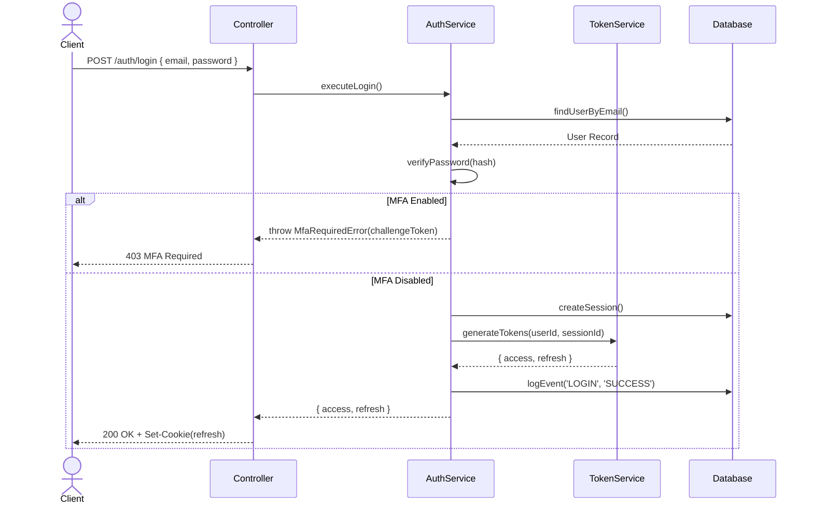
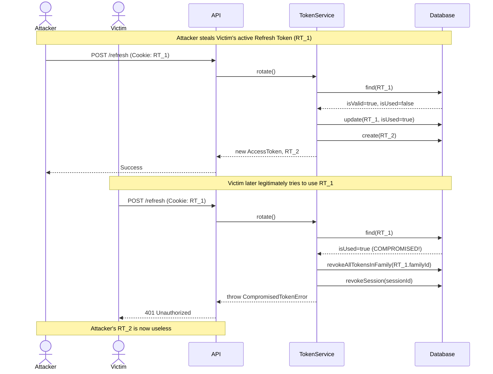

# Authentication Architecture & Implementation Specification

## 1. Module Objectives
The Authentication Module is the core security pillar of the CA Firm ERP. Its objectives are:
- Provide highly secure, stateless API authentication via JWT.
- Support multi-device, concurrent sessions with centralized revocation.
- Provide comprehensive Multi-Factor Authentication (MFA) via TOTP and Email/SMS OTP.
- Strictly enforce multi-tenancy at the authentication layer (users belong to a tenant).
- Monitor, audit, and rate-limit authentication events to prevent brute-force and credential stuffing.
- Expose a foundation for Role-Based Access Control (RBAC).

## 2. Folder Structure
The module will be strictly contained within `src/modules/auth/`, adhering to the separation of concerns:

```text
src/modules/auth/
├── controllers/
│   └── auth.controller.ts
├── services/
│   ├── auth.service.ts
│   ├── mfa.service.ts
│   ├── session.service.ts
│   └── token.service.ts
├── repositories/
│   ├── user.repository.ts
│   ├── session.repository.ts
│   ├── refresh-token.repository.ts
│   ├── otp.repository.ts
│   ├── mfa.repository.ts
│   └── login-history.repository.ts
├── dtos/
│   ├── auth.req.dto.ts     (Zod schemas)
│   └── auth.res.dto.ts     (Response interfaces)
├── guards/
│   ├── jwt.guard.ts
│   └── permission.guard.ts
└── auth.routes.ts
```

## 3. Authentication Request Lifecycle
1. **Request arrives** at an API route.
2. **Global Middlewares:** `correlationId`, `requestLogger`, `rateLimiter` process the request.
3. **`jwtGuard` middleware:** 
   - Extracts Bearer token from `Authorization` header.
   - Verifies the signature using `JWT_ACCESS_SECRET`.
   - Checks if the token is expired.
   - Extracts `{ userId, tenantId, sessionId, roles }` from the payload.
   - Validates that the session has not been revoked (via Redis cache/DB).
   - Injects `req.user` and `req.tenant`.
4. **`permissionGuard` (Optional):** Checks if `req.user` has the required RBAC permissions.
5. **Controller:** Executes the domain logic.
6. **BaseRepository:** Automatically scopes any DB queries using `req.tenant.id`.

## 4. Registration Flow
- **Tenant Context:** Users must be invited or register under a specific `Tenant`.
- **Validation:** Validates email format, strong password criteria (Zod).
- **Hashing:** Hashes password with bcrypt (cost factor 12).
- **Database:** Creates `User` record.
- **Verification:** Generates an `OtpCode` (Purpose: `EMAIL_VERIFY`) and dispatches a background BullMQ job to send the email.

## 5. Login Flow
- **Input:** `email`, `password`, `tenantSlug` (or inferred from subdomain).
- **Verification:** 
  1. Lookup `Tenant` by slug.
  2. Lookup `User` by `email` and `tenantId`.
  3. Compare password hash.
- **MFA Check:** If `MfaConfig.totpEnabled` is true, return a `MFA_REQUIRED` challenge response.
- **Session Creation:** Generate a new `UserSession` tracking IP and User Agent.
- **Tokens:** Generate short-lived Access Token (15m) and long-lived Refresh Token (7d).
- **Audit:** Log `LOGIN` event in `LoginHistory`.

## 6. JWT Access Token Flow
- **Type:** Stateless, digitally signed (HS256).
- **Payload:** `sub` (userId), `tenantId`, `sid` (sessionId), `roles`.
- **Expiration:** 15 minutes.
- **Storage:** Kept in application memory on the frontend, sent via `Authorization: Bearer <token>`.

## 7. Refresh Token Rotation Flow
- **Storage:** Stored in an HTTP-only, secure, SameSite=Strict cookie (or passed securely for mobile apps).
- **Rotation Pattern:** 
  1. Client sends Refresh Token to `/auth/refresh`.
  2. System validates token exists in DB (`RefreshToken` table) and `isUsed === false`.
  3. If token is valid, mark `isUsed = true`.
  4. Generate *new* Access Token and *new* Refresh Token.
  5. Link the new refresh token to the old one's `familyId`.
- **Compromise Detection:** If a reused/revoked Refresh Token is presented, the entire `familyId` of tokens is instantly revoked, and the `UserSession` is terminated.

## 8. Logout Flow
- **Input:** `refreshToken` (from cookie).
- **Action:** 
  1. Mark `UserSession` as `REVOKED` (Reason: `LOGOUT`).
  2. Revoke all `RefreshToken` records tied to the session.
  3. Clear the HTTP-only cookie.
  4. Log `LOGOUT` event in `LoginHistory`.

## 9. Password Reset Flow
1. **Request:** User requests reset via email.
2. **OTP Generation:** System creates `OtpCode` (Purpose: `PASSWORD_RESET`, Type: `EMAIL`, Exp: 15m) and sends email.
3. **Verification:** User submits OTP + new password.
4. **Action:** Update `User.passwordHash`, set `passwordChangedAt = now()`.
5. **Security:** Revoke *all* active `UserSession`s across all devices (Reason: `PASSWORD_CHANGE`).

## 10. Email Verification Flow
1. **Generation:** `OtpCode` created upon registration.
2. **Verification:** Client sends OTP.
3. **Action:** Set `User.emailVerifiedAt = now()`. Mark OTP `isUsed = true`.

## 11. OTP Verification Flow
- Shared logic for all OTPs (Email, SMS, MFA).
- **Guards:** 
  - Max attempts (default 5). If exceeded, lock OTP.
  - Expiry check.
- **Audit:** Increment `attemptCount` on failure.

## 12. MFA Architecture (TOTP + Backup Codes)
- **Enrollment:** 
  1. Generate TOTP secret (`otplib`), encrypt before storing in DB.
  2. Generate QR code for Authenticator app.
  3. Generate 10 Backup Codes, hash them (bcrypt), store in DB.
- **Verification:** User provides TOTP code on login. Service decrypts secret, verifies code.
- **Backup Code:** If TOTP is lost, user inputs a backup code. System verifies hash, removes used code, logs `MFA_SUCCESS`.

## 13. Session Management
- `UserSession` tracks `deviceType`, `browser`, `os`, `ipAddress`.
- Users can view active sessions in their settings.
- Users can revoke specific sessions remotely (e.g., "Log out of all other devices").

## 14. Login History
- All auth events (success, failure, MFA challenges) write to `LoginHistory`.
- `failureReason` is tracked to identify brute-force vectors.

## 15. Device Management
- Fingerprints and user agents are parsed to identify new devices.
- Future scope: Email alert on "New Device Login".

## 16. Security Protections
- **Credential Stuffing:** Rate limited by IP and Email.
- **Timing Attacks:** Consistent password hashing time even if user doesn't exist.
- **Token Theft:** Refresh Token Rotation with compromise detection.
- **XSS:** Refresh tokens in HTTP-only cookies.
- **CSRF:** Origin validation and strict CORS.

## 17. RBAC Integration
- `jwtGuard` injects the user's roles into the request.
- `permissionGuard(action, resource)` checks `RolePermission` cache to authorize endpoints.

## 18. Middleware Execution Order
1. `correlationIdMiddleware`
2. `requestLoggerMiddleware`
3. `rateLimitMiddleware` (strict for Auth routes)
4. `jwtGuard` (for protected routes)
5. `permissionGuard` (for specific actions)
6. Controller logic
7. `errorMiddleware`

## 19. API Contracts

### POST /api/v1/auth/login
**Req:** `{ email, password, tenantSlug }`
**Res:** `{ accessToken, user: { id, email, firstName, roles } }` + `Set-Cookie: refreshToken`
**(If MFA required):** `Res (403): { mfaChallengeToken, methods: ['TOTP'] }`

### POST /api/v1/auth/mfa/verify
**Req:** `{ mfaChallengeToken, code }`
**Res:** `{ accessToken, user }` + `Set-Cookie: refreshToken`

### POST /api/v1/auth/refresh
**Req:** Cookie `refreshToken`
**Res:** `{ accessToken }` + `Set-Cookie: newRefreshToken`

### POST /api/v1/auth/logout
**Req:** Cookie `refreshToken`
**Res:** `{ message: 'Logged out successfully' }`

### POST /api/v1/auth/password/forgot
**Req:** `{ email, tenantSlug }`
**Res:** `{ message: 'If account exists, an email has been sent.' }`

## 20. Repository Responsibilities
All extend `BaseRepository`:
- **UserRepository:** Find by email/tenant, update passwords.
- **SessionRepository:** Track devices, mass revoke by userId.
- **RefreshTokenRepository:** Rotation chain management, compromise detection.
- **OtpRepository:** Verify codes, increment attempt counts safely.
- **LoginHistoryRepository:** Append-only audit logs.

## 21. Service Responsibilities
- **AuthService:** Orchestrates login, registration, password resets.
- **TokenService:** Generates JWTs, manages the Refresh Token rotation cryptography.
- **SessionService:** Parses User-Agents, manages session lifecycle.
- **MfaService:** Generates TOTP secrets, verifies OTPs, handles backup codes.

## 22. Controller Responsibilities
- Receives HTTP requests.
- Maps DTOs to Service calls.
- Attaches HTTP-only cookies to the `Response` object.
- Returns data using `ApiResponseHelper`.

## 23. Validation Schemas (Zod)
- `loginSchema`: Valid email, string password.
- `registerSchema`: Strict password regex (8 chars, 1 upper, 1 number, 1 symbol).
- `resetPasswordSchema`: Password confirmation matching.
- `mfaVerifySchema`: 6-digit numeric string constraint.

## 24. Error Codes
- `AUTH_INVALID_CREDENTIALS` (401)
- `AUTH_ACCOUNT_LOCKED` (403)
- `AUTH_MFA_REQUIRED` (403)
- `AUTH_TOKEN_EXPIRED` (401)
- `AUTH_SESSION_REVOKED` (401)
- `AUTH_COMPROMISED_TOKEN` (401)

## 25. Audit Events
Tracked in `LoginHistory`:
- `LOGIN`, `LOGOUT`, `FAILED_LOGIN`, `TOKEN_REFRESH`, `PASSWORD_RESET`, `MFA_SUCCESS`, `MFA_FAILED`, `ACCOUNT_LOCKED`.

## 26. Rate Limiting Strategy
- **Global:** 100 req / 15m.
- **Auth Login Route:** 5 req / 5m per IP/Email.
- **OTP Verification Route:** 3 req / 5m per IP.

## 27. Testing Strategy
- **Unit Tests:** `AuthService` logic (mocking Repositories), password hashing.
- **Integration Tests:** Refresh Token rotation chains, JWT expiry, concurrent logins, TOTP verification.

## 28. Sequence Diagrams

### Login Flow


### Refresh Token Rotation (Compromise Detection)


---

> [!IMPORTANT]
> **User Review Required**
> Please review the architecture, flow diagrams, and API contracts. Once you approve this specification, I will begin implementing the Repositories, Services, and Controllers step-by-step.
